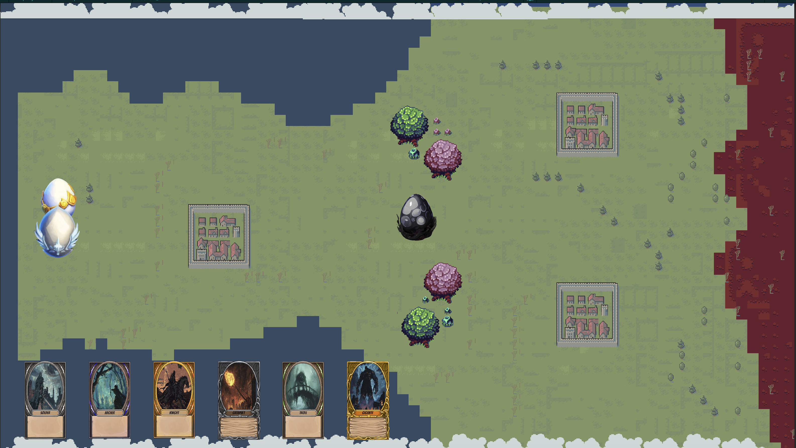
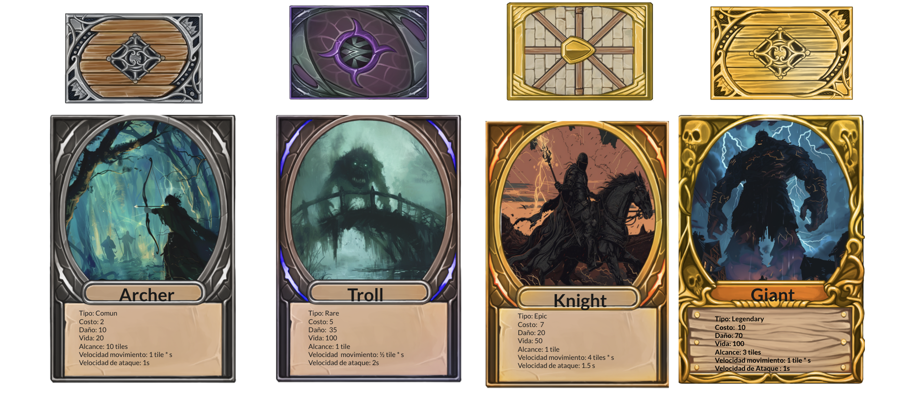

# **Protect the Egg**

## _GDD: Documento de Diseño de Juego_

---

##### **Aviso de derechos de autor**

Pedro Mauri Mtz - A01029143

Michael Andrew Devlyn - A01781041

Tomás Molina Pérez Diez - A01784116

---

## _Índice_

---

1. [Índice](#índice)
2. [Diseño de Juego](#diseño-de-juego)
    1. [Resumen](#resumen)
    2. [Jugabilidad](#jugabilidad)
    3. [Mentalidad](#mentalidad)
3. [Técnico](#técnico)
    1. [Pantallas](#pantallas)
    2. [Controles](#controles)
    3. [Mecánicas](#mecánicas)
4. [Diseño de Niveles](#diseño-de-niveles)
    1. [Temas](#temas)
    2. [Flujo de Juego](#flujo-de-juego)
5. [Desarrollo](#desarrollo)
6. [Gráficos](#gráficos)
7. [Sonidos/Música](#sonidosmúsica)
8. [Cronograma](#cronograma)

## _Diseño de Juego_

---

### **Resumen**

En "Protect the Egg" te enfrascaras en una batalla estrategica contra ordas de monstruos, con la ayuda de cartas invocaras tus tropas con el objetivo de proteger un huevo de dragón. El dominio de creación de mazo, posicionamiento de unidades y la gestión de recursos es clave para la victoria en este competitivo juego 2D para computadoras. ¿Sobrevivirás?

---

### **Jugabilidad**

#### **Juego**

Cada orda de monstruos es más dificil que la anterior, mientras que la misma orda en dos partida diferentes tienen resultados distintos con la misma dificultad. Esto le da una buena jugabilidad al tener variación entre las partidas.

#### **Premios / Recompensas**

Tras acabar cada partida, el juego guardarán los datos de la partida como los puntos y ordas en tu perfil, los cuales se rankearán dandole un toque de competibidad por ver quien consigue más puntos.

---

### **Mentalidad**

El juego provoca una mentalidad de estratégica y adaptabilidad. Los jugadores deberían sentir la tensión de la gestión de recursos, la emoción de sobrevivir las ordas de monstruos. La estarategia del juego tiene muchas facetas, desde la creación de mazo, administración de recursos, el posicionamiento y control del tiempo para la colocación de cartas, etc.

---

## _Técnico_

---

### **Pantallas**

---

#### **Pantalla de Título**
Primer pantalla al entrar al juego.
- **Título del juego**: Logo del juego.
- **Iniciar Sesión/Registro**: Lleva a los jugadores a la pantalla de Log In para iniciar sesión o registrarse.

#### **Pantalla de Iniciar Sesión/Registro**
- **Log In**: Los jugadores existentes pueden ingresar su usuario y contraseña para acceder a sus perfiles.
- **Registro**: Nuevos jugadores pueden crear una cuenta, proporcionando un usuario, correo electrónico y contraseña.

#### **Pantalla Principal**
- **Iniciar Partida**: Lleva a los jugadores a la pantalla de partidas.
- **Selección de Mazo**: Lleva a los jugadores a la pantalla de selección de mazo.
- **¿Cómo Jugar?**: Lleva a los jugadores a la pantalla de ¿Cómo Jugar?.
- **Opciones**: Lleva a los jugadores a la pantalla de configuraciones.
- **Créditos**: Lleva a los jugadores a la pantalla de créditos.
- **Salir**: Opción para cerrar el juego.

#### **Pantalla Partidas**
- **Mapa de Partida**: Campo de batalla.
- **Mano**: Cartas disponibles para usar.
- **Menu de Pausa**: Lleva a los jugadores a la pantalla de pausa.
- **Visuales**: Efectos visuales reactivos a las acciones de la partida.

#### **Pantalla de Victoria/Derrota**
Al finalizar una partida, los jugadores son dirigidos a esta pantalla, que muestra el resultado de la partida.
- **¿Jugar de Nuevo?**: Regresa a los jugadores la pantalla de partidas para comenzar otra.
- **Salir**: Regresa a los jugadores a la pantalla de pantalla principal.

#### **Pantalla de menu de pausa**
- **Reanudar**: Regresa al jugador a la pantalla de partida.
- **Opciones**: Lleva a los jugadores a la pantalla de configuraciones.
- **Salir**: Lleva a los jugadores a la pantalla principal.

#### **Selección de Mazo**
Una interfaz dedicada a la gestión de mazos, donde los jugadores pueden:
- **Crear Mazo**: Interface para la creación de nuevos mazos, con acceso a todas las cartas disponibles.
- **Listas de Mazos**: Visualización y edición de mazos existentes.
- **Todas las Cartas**: Exploración de todas las cartas disponibles, incluyendo descripciones y estadísticas.
- **Salir**: Regresa a los jugadores a la pantalla de pantalla principal.

#### **Pantalla de ¿Cómo Jugar?**
- **Documento de Instrucciones**: Documento sobre cómo jugar "Tower Siege" incluyendo reglas.
- **Salir**: Regresa a los jugadores a la pantalla de pantalla principal.

#### **Pantalla de Opciones**
Permite a los jugadores personalizar su experiencia de juego.
- **Volumen**: Control de volumen para música y efectos de sonido.
- **Teclas Personalizables**: Configuración de controles de teclado para adaptarse a las preferencias del jugador.
- **Salir**: Regresa a los jugadores a la pantalla de donde venga.

#### **Pantalla de Créditos**
- **Info de los desarrolladores**: Nombres y matriculas.

---

### **Controles**

- **Ratón**: Navegar por los menús, seleccionar cartas y mazos, colocar unidades.
- **Teclado**: Atajos para la selección de cartas, manejo de tropas, menu de pausa, etc.

---

### **Mecánicas**

---

#### **General**

El juego consiste en proteger un nido de huevos de dragón de monstruos, el nido esta ubicado en el costado izquierdo del tablero mientras que un de los huevos esta a la mitad del mapa y por medio de cartas que invocan NPC y obstáculos será como lo protegerás. Al usar una carta en el tablero hará que aparezca el personaje de la carta en el lugar colocado, cada carta tiene un costo de recursos para desplegar. Los monstruos atacan al huevo por medio de ordas cada una con mayor dificultad.
¿Por cuantas ordas podras proteger el huevo?
El juego desafía a los jugadores a gestionar estos recursos y en desplegar unidades estratégicamente para cuidar del nideo de huevos; cuando destruyen el huevo de enmedio todos los monstruos en pantalla en ese momento morirán Y el área de invocación de las cartas del jugador se verá reducida. Si las torres de protección predeterminadas son destruidas, así como en el caso del huevo central; el área de invocación de las cartas del jugador se verá reducida.

#### **Creación de Mazos**

El jugador crea un mazo de 20 cartas de un pool de 20 tipos de cartas, consistiendo en que el jugador pueda tener cartas repetidas si quiere, el menú de creación de mazos se encuentra en el menú principal del juego, tambien se encontrará toda la información de cada carta para poder elegir con conciencia.

#### **Mano, Mazos e Invocación de cartas**

El jugador empieza la partida con una mano de 6 cartas, al utilizar una carta; esta se descartará mientras que una nueva del mazo la remplazará. Cuando todas las cartas del mazo se hayan utilizado, las cartas se deben revolver, por lo tanto, se pasaran 7 segundos sin poder poner cartas mientras que estas se revuelven. Al pasar estos 7 segundos, el ciclo del mazo y la mano se reinicia de nuevo.

Para invocar una carta se requiere tenerla en la mano y tener el "elixir de dragón" suficiente para su costo de invocación, cada carta tiene un costo de elixir para que sea invocada dependiendo de sus estadísticas personales. Al comenzar la partida; el jugador comenzará con 5 de elixir y cada 10 segundos el nido le brindará 10 de elixir, mientras que el máximo que se puede almacenar al mismo tiempo es 20 de elixir, la administración del elixir es esencial para poder invocar tus cartas con el maximo provecho del recurso, ya que este se puede perder al no tener espacio de almacenamiento en el momento.

#### **Victoria**

¿Por cuantas ordas de monstruos podras proteger al huevo de dragón?, ¿O derrotaste a todas las ordas de monstruos? Tras terminar la partida, se guardará tu puntuación.

---

## _Diseño de Niveles_

---

### **Temas**

#### **Campo de Batalla**

- **Ambiente**: Campo de batalla medieval; muy forestal, con caminos, arboles, lagos, ríos, torres de piedra, etc.
- **Ambientes Detallados**:
  - **Bosques Espesos**: Los árboles no solo añaden complejidad visual, sino que también pueden ofrecer cobertura táctica o ser obstáculos.
  - **Cuerpos de Agua**: Lagos añaden barreras naturales, forzando a los jugadores a adaptar sus estrategias de movimiento y posicionamiento.
  - **Torres**: Elementos icónicos del paisaje que sirven como objetivos críticos y puntos de fortaleza.

- **Objetos en el Campo de Batalla**:
  - **Interactivos**:
    - **Obstáculos Naturales**: Rocas y árboles pueden bloquear o desviar el avance, mientras que ríos y lagos limitan el acceso a ciertas áreas, requiriendo estrategias adaptativas.
    - **Objetivos Estratégicos**: El huevo central y las torres de protección actúan como catalizadores de confrontaciones, con su destrucción ofreciendo ventajas tácticas decisivas.
  - **Decorativos**: Elementos como rocas, estanques pequeños, y árboles añaden profundidad al mundo del juego, mejorando la inmersión sin afectar directamente la jugabilidad.

---

### **Flujo de Juego Estratégico**

1. **Selección de Mazo**: Cada jugador elige cuidadosamente un mazo de batalla, planeando su estrategia basada en las cartas disponibles y potenciales tácticas enemigas.

2. **Generación de Recursos**: Al inicio de la batalla, los jugadores comienzan a acumular recursos esenciales para el despliegue de unidades, estableciendo la base para la estrategia económica del juego.

3. **Despliegue Táctico de Unidades**: Utilizando el mazo seleccionado, los jugadores colocan unidades en el campo de batalla, con cada decisión influenciada por el diseño del nivel, la composición del mazo enemigo, y los objetivos estratégicos inmediatos.

4. **Conquista y Defensa**: La interacción dinámica entre atacar y defender torres centrales y la torre principal enemiga dicta el ritmo de la partida, con el terreno jugando un papel crucial en el éxito de estas maniobras.

5. **Victorias Condicionales**: La partida culmina con la destrucción de la torre principal de un jugador, pero las estrategias para llegar a este punto varían enormemente, influenciadas por el diseño del nivel y las decisiones tácticas.

---

## _Desarrollo_

---

### **Clases Abstractas / Componentes**

1. **Carta**
    - Atributos: Descripción, Vida, Velocidad, Daño, Velocidad de Ataque, Rango, Costo, Enemigos Objetivo, Tipo (Ataque/Defensa).

2. **Unidad**
    - Derivado de Carta: Soldado, Caballero, Arquero, Catapulta, Trol, Gigante, Fantasma, Goblin, Orco, Escudo, Healer, Mago, Dragon, Bruja, Sacerdote, Lanzador de Javalina, Asesino, Elemental de Fuego, Centauro, Nigromante.

3. **Torre**
    - Atributos: Vida, Daño, Rango de Ataque.

---

### **Listado de Clases a Programar**

- **Clase `Game`**:
  - **Responsabilidad**: Administrar el flujo del juego, el estado de la partida y las transiciones entre diferentes pantallas (menús, juego, victoria/derrota).
  - **Métodos importantes**:
    - `startGame()`: Inicia una nueva partida.
    - `pauseGame()`: Pausa la partida en curso.
    - `endGame()`: Finaliza la partida y muestra resultados.

- **Clase `Player`**:
  - **Responsabilidad**: Representar a cada jugador, manteniendo su puntuación, mazo de cartas y acciones disponibles.
  - **Propiedades**:
    - `deck`: Una colección de objetos `Card`.
    - `score`: Puntuación actual del jugador.
  - **Métodos**:
    - `playCard()`: Juega una carta del mazo.
    - `calculateScore()`: Actualiza la puntuación basada en el juego.

- **Clase `Card`**:
  - **Responsabilidad**: Definir las características y comportamiento de las cartas utilizadas en el juego.
  - **Propiedades**:
    - `cost`: Recursos necesarios para jugar la carta.
    - `cooldown`: Tiempo de espera antes de que la carta pueda ser utilizada nuevamente.
  - **Métodos**:
    - `activate()`: Ejecuta la acción de la carta cuando se juega.

- **Clase `Unit`**:
  - **Responsabilidad**: Actuar como la superclase para todas las unidades de combate en el juego, definiendo propiedades comunes y métodos.
  - **Propiedades**:
    - `health`: La salud actual de la unidad.
    - `damage`: El daño que la unidad puede infligir.
  - **Métodos**:
    - `move()`: Mueve la unidad en el campo de batalla.
    - `attack()`: Realiza un ataque a enemigos o estructuras.

- **Clase `Tower`**:
  - **Responsabilidad**: Controlar el estado y la defensa de las torres en el juego.
  - **Propiedades**:
    - `location`: La posición de la torre en el mapa.
    - `defense`: La capacidad defensiva de la torre.
  - **Métodos**:
    - `receiveDamage()`: Reduce la salud de la torre cuando es atacada.

- **Clase `Resource`**:
  - **Responsabilidad**: Gestionar los recursos del jugador, que son necesarios para desplegar unidades y realizar acciones.
  - **Propiedades**:
    - `amount`: La cantidad actual de recursos disponibles.
  - **Métodos**:
    - `generate()`: Incrementa los recursos con el tiempo.
    - `spend()`: Deduce los recursos al jugar cartas o realizar acciones.

- **Clase `AI`**:
  - **Responsabilidad**: Dirigir la lógica de los oponentes controlados por la computadora, permitiendo una jugabilidad desafiante y dinámica.
  - **Métodos**:
    - `determineStrategy()`: Decide una estrategia basada en el estado actual del juego.
    - `executeAction()`: Realiza una acción basada en la estrategia determinada.

---

### **Clases Derivadas / Composiciones de Componentes**

---

#### **Unidades**

- **Soldado**:
  - Tipo: Común
  - Costo: 1
  - Daño: 15
  - Vida: 50
  - Alcance: 1 tile
  - Velocidad de movimiento: 1 tile/s
  - Velocidad de ataque: 1.5 s
  - Enemigos objetivo: Cualquiera
  - Tipo: Ataque

- **Caballero**:
  - Tipo: Raro
  - Costo: 5
  - Daño: 25
  - Vida: 120
  - Alcance: 1 tile
  - Velocidad de movimiento: 2 tiles/s
  - Velocidad de ataque: 2 s
  - Enemigos objetivo: Cualquiera
  - Tipo: Ataque

- **Arquero**:
  - Tipo: Común
  - Costo: 2
  - Daño: 20
  - Vida: 30
  - Alcance: 3 tiles
  - Velocidad de movimiento: 1 tile/s
  - Velocidad de ataque: 1 s
  - Enemigos objetivo: Cualquiera
  - Tipo: Ataque

- **Catapulta**:
  - Tipo: Épico
  - Costo: 6
  - Daño: 40
  - Vida: 60
  - Alcance: 5 tiles
  - Velocidad de movimiento: 0.5 tile/s
  - Velocidad de ataque: 3 s
  - Enemigos objetivo: Estructuras
  - Tipo: Ataque

- **Trol**:
  - Tipo: Raro
  - Costo: 7
  - Daño: 30
  - Vida: 150
  - Alcance: 1 tile
  - Velocidad de movimiento: 0.75 tile/s
  - Velocidad de ataque: 2.5 s
  - Enemigos objetivo: Cualquiera
  - Tipo: Ataque

- **Gigante**:
  - Tipo: Legendario
  - Costo: 10
  - Daño: 70
  - Vida: 200
  - Alcance: 2 tiles
  - Velocidad de movimiento: 0.6 tile/s
  - Velocidad de ataque: 3 s
  - Enemigos objetivo: Cualquiera
  - Tipo: Ataque

- **Fantasma**:
  - Tipo: Épico
  - Costo: 7
  - Daño: 10 (ataque pasante)
  - Vida: 80
  - Alcance: 0 (ataque pasante)
  - Velocidad de movimiento: 1.5 tiles/s
  - Velocidad de ataque: 1 ataque cada que atraviesa una unidad
  - Enemigos objetivo: Cualquiera
  - Tipo: Ataque especial

- **Goblin**:
  - Tipo: Común
  - Costo: 2
  - Daño: 5
  - Vida: 25
  - Alcance: 1 tile
  - Velocidad de movimiento: 2.5 tiles/s
  - Velocidad de ataque: 1 s
  - Enemigos objetivo: Cualquiera
  - Tipo: Ataque

- **Orco**:
  - Tipo: Común
  - Costo: 3
  - Daño: 30
  - Vida: 100
  - Alcance: 1 tile
  - Velocidad de movimiento: 1 tile/s
  - Velocidad de ataque: 1.8 s
  - Enemigos objetivo: Cualquiera
  - Tipo: Ataque

- **Escudo**:
  - Tipo: Raro
  - Costo: 4
  - Daño: 10
  - Vida: 150
  - Alcance: 1 tile
  - Velocidad de movimiento: 0.8 tile/s
  - Velocidad de ataque: 2 s
  - Enemigos objetivo: Cualquiera
  - Tipo: Defensa

- **Healer**:
  - Tipo: Épico
  - Costo: 6
  - Daño: 0
  - Vida: 40
  - Alcance: 3 tiles
  - Velocidad de movimiento: 1 tile/s
  - Velocidad de ataque: 2 s (ritmo de curación)
  - Enemigos objetivo: N/A (aliados)
  - Tipo: Soporte

- **Mago**:
  - Tipo: Raro
  - Costo: 7
  - Daño: 40 (daño en área)
  - Vida: 50
  - Alcance: 3 tiles
  - Velocidad de movimiento: 0.8 tile/s
  - Velocidad de ataque: 2.5 s
  - Enemigos objetivo: Cualquiera
  - Tipo: Ataque

- **Dragon**:
  - Tipo: Legendario
  - Costo: 10
  - Daño: 50 (daño en área)
  - Vida: 150
  - Alcance: 4 tiles
  - Velocidad de movimiento: 1 tile/s (vuelo)
  - Velocidad de ataque: 3 s
  - Enemigos objetivo: Cualquiera
  - Tipo: Ataque

- **Bruja**:
  - Tipo: Raro
  - Costo: 8
  - Daño: 25
  - Vida: 60
  - Alcance: 3 tiles
  - Velocidad de movimiento: 0.7 tile/s
  - Velocidad de ataque: 2 s
  - Enemigos objetivo: Cualquiera
  - Tipo: Ataque mágico

- **Sacerdote**:
  - Tipo: Épico
  - Costo: 7
  - Daño: 0
  - Vida: 70
  - Alcance: 3 tiles
  - Velocidad de movimiento: 1 tile/s
  - Velocidad de ataque: 2 s (ritmo de beneficio)
  - Enemigos objetivo: N/A (aliados)
  - Tipo: Soporte

- **Lanzador de Javalina**:
  - Tipo: Común
  - Costo: 4
  - Daño: 25
  - Vida: 40
  - Alcance: 3 tiles
  - Velocidad de movimiento: 1.2 tile/s
  - Velocidad de ataque: 1.7 s
  - Enemigos objetivo: Cualquiera
  - Tipo: Ataque

- **Asesino**:
  - Tipo: Raro
  - Costo: 6
  - Daño: 60
  - Vida: 30
  - Alcance: 1 tile
  - Velocidad de movimiento: 3 tiles/s
  - Velocidad de ataque: 1 s
  - Enemigos objetivo: Alta prioridad (healers, unidades de rango)
  - Tipo: Ataque

- **Elemental de Fuego**:
  - Tipo: Épico
  - Costo: 9
  - Daño: 45 (daño por quemadura)
  - Vida: 80
  - Alcance: 2 tiles
  - Velocidad de movimiento: 0.9 tile/s
  - Velocidad de ataque: 2 s
  - Enemigos objetivo: Cualquiera
  - Tipo: Ataque

- **Centauro**:
  - Tipo: Común
  - Costo: 5
  - Daño: 35
  - Vida: 80
  - Alcance: 2 tiles
  - Velocidad de movimiento: 2 tiles/s
  - Velocidad de ataque: 1.5 s
  - Enemigos objetivo: Cualquiera
  - Tipo: Ataque

- **Nigromante**:
  - Tipo: Legendario
  - Costo: 10
  - Daño: 20
  - Vida: 60
  - Alcance: 3 tiles
  - Velocidad de movimiento: 0.6 tile/s
  - Velocidad de ataque: 2.5 s (ritmo de invocación)
  - Enemigos objetivo: Cualquiera
  - Tipo: Soporte/Ataque

---

#### **Obstáculos**

- **Árbol&Roca**: Proporciona cobertura y es un obstaculo.
- **Lago**: Obstáculo natural que limita el movimiento; solo ciertas unidades pueden cruzarlo.

---

## _Gráficos_

---

### **Atributos de Estilo**

- **Colores**: Vibrantes, colores de equipo distintos para claridad
- **Estilo**: Semi-realista con elementos estilizados, asegurando que las unidades y el terreno sean fácilmente distinguibles.
- **Retroalimentación**: Explosiones para unidades destruidas, contornos brillantes para unidades seleccionables.

### **Gráficos Necesarios**

1. **Unidades**: Sprites animados para cada tipo de unidad.
2. **Terreno**: Texturas variadas para diferentes terrenos (césped, agua, arbol).
3. **Efectos**: Efectos visuales para ataques, recolección de recursos.

### **Listado de Assets**

- Sprites de personajes
- Texturas de terreno
- Elementos de UI (botones, barras de vida, indicadores de recursos)
- Iconos de habilidades y hechizos
- Efectos visuales (explosiones, efectos mágicos, etc.)
- Fondos y paisajes
- Assets de decoración (árboles, rocas, estructuras)

## _Sonidos/Música_

---

### **Atributos de Estilo**

- **Instrumentos**: Partituras orquestales con un ritmo dinámico que refleja la intensidad del juego.
- **Efectos de Sonido**: Choque de espadas, pasos de marcha y ruidos de construcción para una jugabilidad inmersiva.

---

### **Sonidos Necesarios**

1. **Movimientos de Unidades**: Cada tipo de unidad tiene sonidos de pasos distintos.
2. **Combate**: Diferentes sonidos para ataques cuerpo a cuerpo, a distancia y de asedio.
3. **Ambientales**: Ambiente de fondo que refleja el terreno actual.

---

### **Música Necesaria**

1. **Tema Principal**: Una pieza orquestal heroica que establece el tono épico del juego.
2. **Música de Batalla**: Música rápida e intensa que se reproduce durante el combate, con variaciones dependiendo de la etapa de la batalla.
3. **Temas de Victoria/Derrota**: Temas distintos que se reproducen al ganar o perder una partida, capturando el ambiente de triunfo o pérdida.
4. **Música de Menú**: Música de fondo sutil y atmosférica para los menús del juego y la pantalla de selección de mazo.

---

## _Cronograma_

---

1. **Fase de Concepto y Diseño** (sem 1-2)
    - Finalizar concepto de juego, mecánicas y documento de diseño.
    - Comenzar arte preliminar y bocetos conceptuales.

2. **Fase de Desarrollo** (sem  3-5)
    - Desarrollar mecánicas de juego principales e implementar jugabilidad básica.
    - Crear niveles iniciales y probar equilibrio.
    - Implementar elementos básicos de UI y controles.

3. **Producción de Arte y Sonido** (sem 6-8)
    - Finalizar todos los activos gráficos incluyendo personajes, entornos y UI.
    - Grabar e integrar efectos de sonido y pistas musicales.

4. **Pruebas y Refinamiento** (sem 9-10)
    - Realizar sesiones de prueba para recopilar comentarios.
    - Refinar jugabilidad, equilibrar unidades y pulir gráficos/sonido.

5. **Preparación para el Lanzamiento** (sem 11)
    - Lanzar el juego.

6. **Soporte Post-Lanzamiento** (Continuo)
    - Monitorear comentarios de los jugadores y abordar cualquier problema con actualizaciones.
    - Lanzar contenido adicional (p.ej., nuevas unidades, mapas) basado en la demanda de los jugadores.

---
