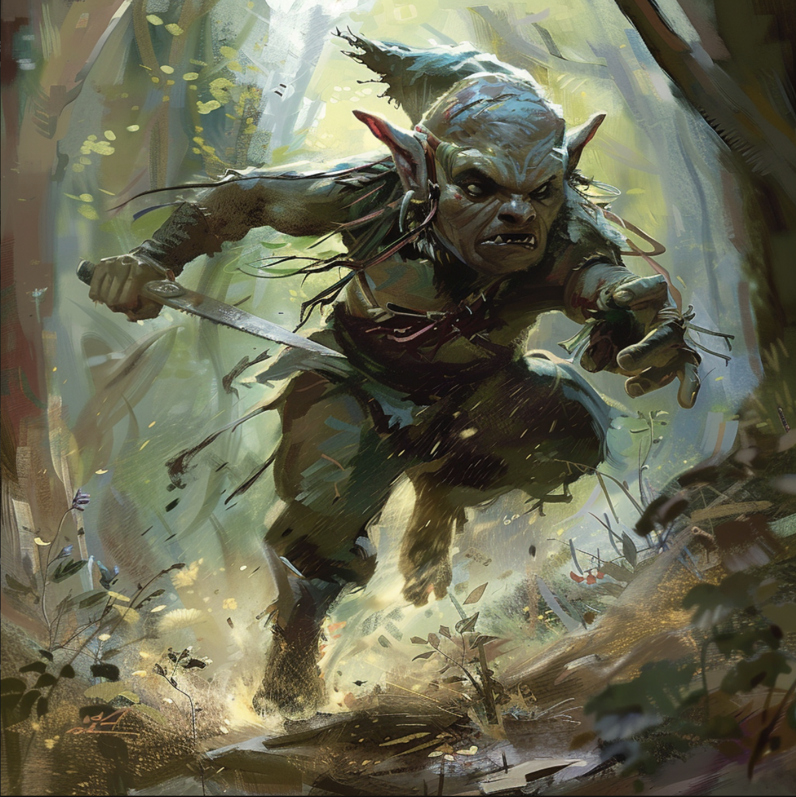
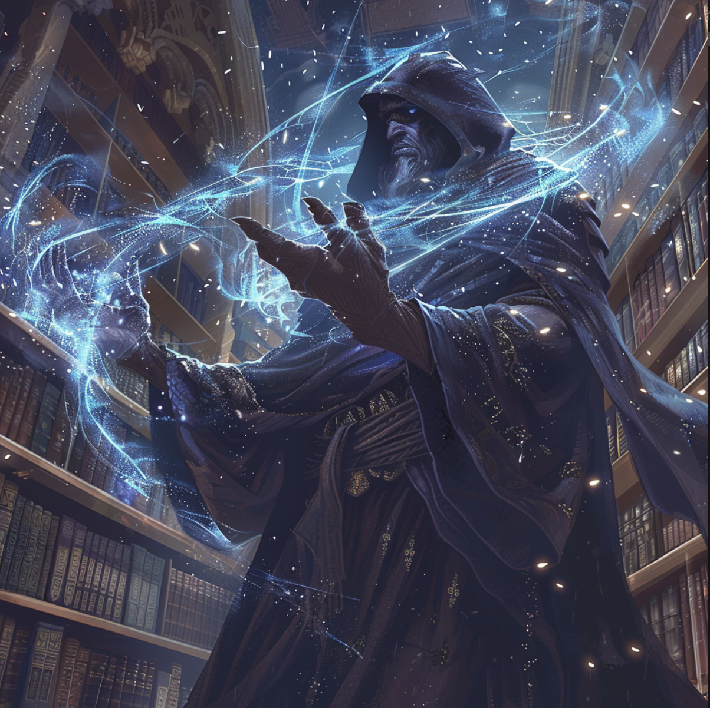
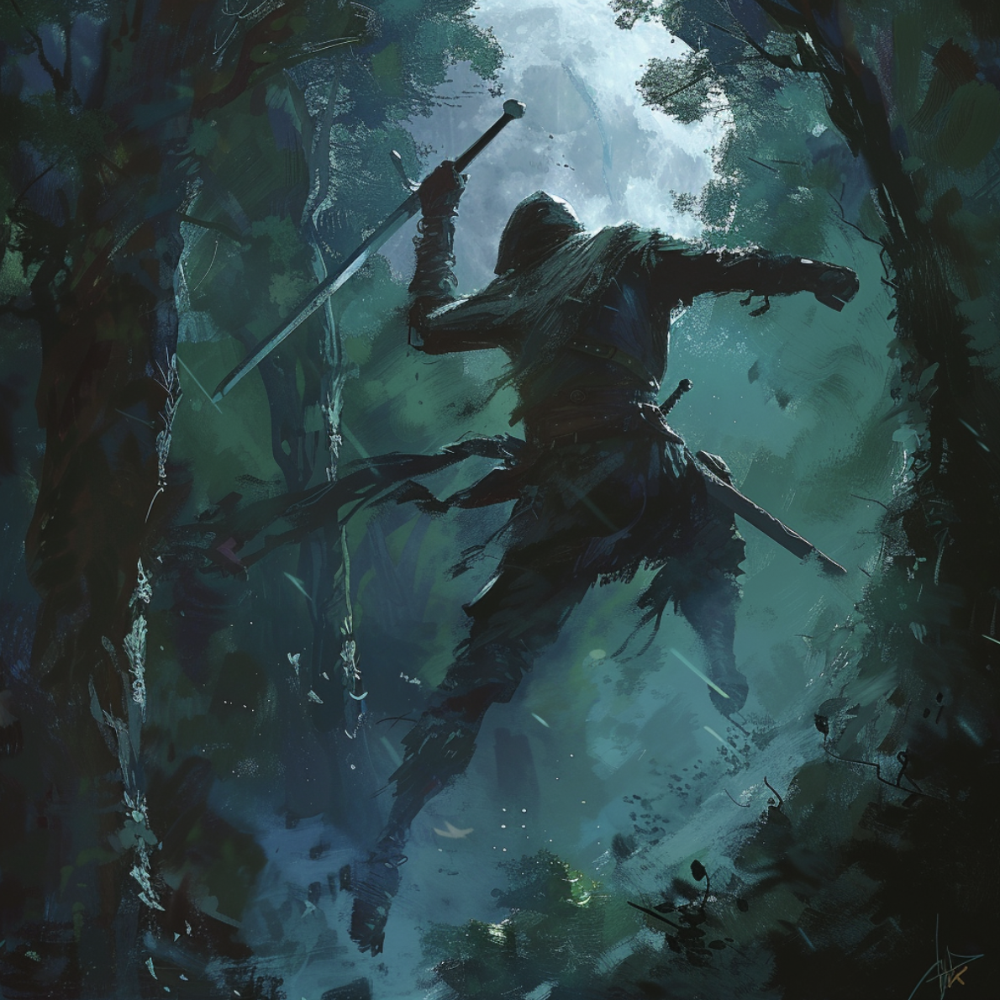
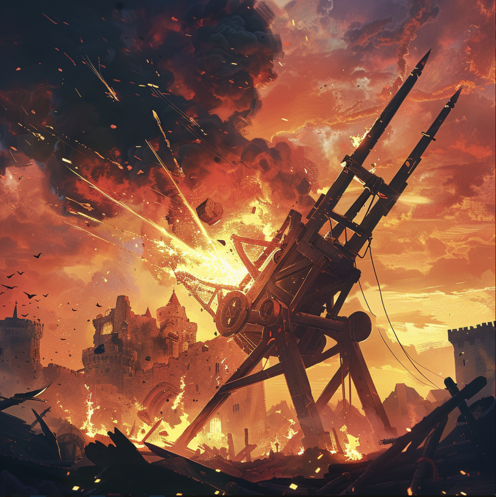

# **Protect the Egg**

## _GDD: Documento de Diseño de Juego_

---

##### **Aviso de derechos de autor**

Pedro Mauri Mtz - A01029143

Michael Andrew Devlyn - A01781041

Tomás Molina Pérez Diez - A01784116

---

## _Índice_

---

1. [Índice](#índice)
2. [Diseño de Juego](#diseño-de-juego)
    1. [Resumen](#resumen)
    2. [Jugabilidad](#jugabilidad)
    3. [Mentalidad](#mentalidad)
3. [Técnico](#técnico)
    1. [Pantallas](#pantallas)
    2. [Controles](#controles)
    3. [Mecánicas](#mecánicas)
4. [Diseño de Niveles](#diseño-de-niveles)
    1. [Temas](#temas)
    2. [Flujo de Juego](#flujo-de-juego)
5. [Desarrollo](#desarrollo)
6. [Gráficos](#gráficos)
7. [Sonidos/Música](#sonidosmúsica)
8. [Cronograma](#cronograma)

## _Diseño de Juego_

---

### **Resumen**

En "Protect the Egg" te enfrascaras en una batalla estratégica contra ordas de monstruos, con la ayuda de cartas invocaras tus tropas con el objetivo de proteger un huevo de dragón. El dominio de creación de mazo, posicionamiento de unidades y estrucutras, más la gestión de recursos es clave para la victoria en este competitivo juego 2D para computadoras. El juego desafía a los jugadores a gestionar estos recursos y en desplegar unidades estratégicamente para cuidar el huevo de dragón ¿Por cuantas ordas podras protegerlo?
---

### **Jugabilidad**

#### **Juego**

Cada orda de monstruos es más dificil que la anterior, mientras que la misma orda en dos partida diferentes tienen resultados distintos con la misma dificultad. Esto le da una buena jugabilidad al tener variación entre las partidas.

#### **Premios / Recompensas**

Tras acabar cada partida, el juego guardarán los datos de la partida como los puntos y ordas en tu perfil, los cuales se rankearán dandole un toque de competibidad por ver quien consigue más puntos.

---

### **Mentalidad**

El juego provoca una mentalidad de estratégica y adaptabilidad. Los jugadores deberían sentir la tensión de la gestión de recursos, la emoción de sobrevivir las ordas de monstruos. La estarategia del juego tiene muchas facetas, desde la creación de mazo, administración de recursos, el posicionamiento y control del tiempo para la colocación de cartas, etc.

---

## _Técnico_

---

### **Pantallas**

---

#### **Pantalla de Título**
Primer pantalla al entrar al juego.
- **Título del juego**: Logo del juego.
- **Iniciar Sesión/Registro**: Lleva a los jugadores a la pantalla de Log In para iniciar sesión o registrarse.

#### **Pantalla de Iniciar Sesión/Registro**
- **Log In**: Los jugadores existentes pueden ingresar su usuario y contraseña para acceder a sus perfiles.
- **Registro**: Nuevos jugadores pueden crear una cuenta, proporcionando un usuario, correo electrónico y contraseña.

#### **Pantalla Principal**
- **Iniciar Partida**: Lleva a los jugadores a la pantalla de partidas.
- **Selección de Mazo**: Lleva a los jugadores a la pantalla de selección de mazo.
- **¿Cómo Jugar?**: Lleva a los jugadores a la pantalla de ¿Cómo Jugar?.
- **Opciones**: Lleva a los jugadores a la pantalla de configuraciones.
- **Créditos**: Lleva a los jugadores a la pantalla de créditos.
- **Salir**: Opción para cerrar el juego.

#### **Pantalla Partidas**
- **Mapa de Partida**: Campo de batalla.
- **Mano**: Cartas disponibles para usar.
- **Menu de Pausa**: Lleva a los jugadores a la pantalla de pausa.
- **Visuales**: Efectos visuales reactivos a las acciones de la partida.

#### **Pantalla de Victoria/Derrota**
Al finalizar una partida, los jugadores son dirigidos a esta pantalla, que muestra el resultado de la partida.
- **¿Jugar de Nuevo?**: Regresa a los jugadores la pantalla de partidas para comenzar otra.
- **Salir**: Regresa a los jugadores a la pantalla de pantalla principal.

#### **Pantalla de menu de pausa**
- **Reanudar**: Regresa al jugador a la pantalla de partida.
- **Opciones**: Lleva a los jugadores a la pantalla de configuraciones.
- **Salir**: Lleva a los jugadores a la pantalla principal.

#### **Selección de Mazo**
Una interfaz dedicada a la gestión de mazos, donde los jugadores pueden:
- **Crear Mazo**: Interface para la creación de nuevos mazos, con acceso a todas las cartas disponibles.
- **Listas de Mazos**: Visualización y edición de mazos existentes.
- **Todas las Cartas**: Exploración de todas las cartas disponibles, incluyendo descripciones y estadísticas.
- **Salir**: Regresa a los jugadores a la pantalla de pantalla principal.

#### **Pantalla de ¿Cómo Jugar?**
- **Documento de Instrucciones**: Documento sobre cómo jugar "Tower Siege" incluyendo reglas.
- **Salir**: Regresa a los jugadores a la pantalla de pantalla principal.

#### **Pantalla de Opciones**
Permite a los jugadores personalizar su experiencia de juego.
- **Volumen**: Control de volumen para música y efectos de sonido.
- **Teclas Personalizables**: Configuración de controles de teclado para adaptarse a las preferencias del jugador.
- **Salir**: Regresa a los jugadores a la pantalla de donde venga.

#### **Pantalla de Créditos**
- **Info de los desarrolladores**: Nombres y matriculas.

---

### **Controles**

- **Ratón**: Navegar por los menús, seleccionar cartas y mazos, colocar unidades.
- **Teclado**: Atajos para la selección de cartas, manejo de tropas, menu de pausa, etc.

---

### **Mecánicas**

---

#### **En Partida**

El objetivo principal del juego consiste en proteger un huevo de dragón el cual es atacado por oleadas de monstruos, por medio de cartas de invocación de personajes (NPC) y estrucutras.

Para invocar cartas, dispones de elixir de dragón como recurso de invocación, la cantidad empieza en 10 puntos, y este aumenta en 10 puntos cada 10 segundos y el límite de almacenamiento es de 50 puntos, cada carta tiene un costo para desplegar y puedes ver la cantidad de elixir que dispones en la esquina superior izquierda.

Para usar una carta, para moverte entre las cartas entre tu mano; se seleccionan con las teclas; 1, 2, 3, 4, 5 y 6. Mientras que con click derecho, el personaje o estrucutra se colocará en la posición del mouse. Ten en cuenta que hay una zona limitada para invocar cartas, si intentas colocarla de esta zona, no se colocará la carta y se marcará el límite de la zona.

Tras haber usado las 20 cartas de tu mazo; estas se volverán a revolver para que las puedas volver a usar, este proceso dura 5 segundos, en los cuales no podrás usar ninguna carta, en alado derecho de las cartas "en mano" se encuentra el contador de cartas restantes en el mazo.

Por otra parte, las oleadas de monstruos se van poniendo progresivamente más dificiles, el contador de la orda en la que te encuentras se ubica en el centro de la parte superior.

#### **Selección y Creación de Mazos**

Para poder jugar, debes crear almenos un mazo de los 5 disponibles, cada mazo debe de tener 20 cartas exactas y un nombre para poderse guardar, las cartas se pueden repetir siempre y cuando el total sea 20, tambien se encontrará toda la información de cada carta para poder elegir con conciencia.

#### **Selección de Mapa**

Tras elegir tu mazo, debes de elegir en cual de los 3 mapas jugarás, al clickear en el botón del mapa elegido, se comenzará la partida con tu mazo seleccionado y mapa elegido.

#### **Victoria**

¿Por cuantas ordas de monstruos podras proteger al huevo de dragón? Tras terminar la partida, se guardará tu puntuación.

---

## _Diseño de Niveles_

---

### **Temas**

#### **Campo de Batalla**

- **Ambiente**: Campo de batalla medieval; muy forestal, con caminos, arboles, lagos, ríos, torres de piedra, etc.
- **Ambientes Detallados**:
  - **Bosques Espesos**: Los árboles no solo añaden complejidad visual, sino que también pueden ofrecer cobertura táctica o ser obstáculos.
  - **Cuerpos de Agua**: Lagos añaden barreras naturales, forzando a los jugadores a adaptar sus estrategias de movimiento y posicionamiento.
  - **Torres**: Elementos icónicos del paisaje que sirven como objetivos críticos y puntos de fortaleza.

- **Objetos en el Campo de Batalla**:
  - **Interactivos**:
    - **Obstáculos Naturales**: Rocas y árboles pueden bloquear o desviar el avance, mientras que ríos y lagos limitan el acceso a ciertas áreas, requiriendo estrategias adaptativas.
    - **Objetivos Estratégicos**: El huevo central y las torres de protección actúan como catalizadores de confrontaciones, con su destrucción ofreciendo ventajas tácticas decisivas.
  - **Decorativos**: Elementos como rocas, estanques pequeños, y árboles añaden profundidad al mundo del juego, mejorando la inmersión sin afectar directamente la jugabilidad.

---

### **Flujo de Juego Estratégico**

1. **Selección de Mazo**: Cada jugador elige cuidadosamente un mazo de batalla, planeando su estrategia basada en las cartas disponibles y potenciales tácticas enemigas.

2. **Generación de Recursos**: Al inicio de la batalla, los jugadores comienzan a acumular recursos esenciales para el despliegue de unidades, estableciendo la base para la estrategia económica del juego.

3. **Despliegue Táctico de Unidades**: Utilizando el mazo seleccionado, los jugadores colocan unidades en el campo de batalla, con cada decisión influenciada por el diseño del nivel, la composición del mazo enemigo, y los objetivos estratégicos inmediatos.

4. **Conquista y Defensa**: La interacción dinámica entre atacar y defender torres centrales y la torre principal enemiga dicta el ritmo de la partida, con el terreno jugando un papel crucial en el éxito de estas maniobras.

5. **Victorias Condicionales**: La partida culmina con la destrucción de la torre principal de un jugador, pero las estrategias para llegar a este punto varían enormemente, influenciadas por el diseño del nivel y las decisiones tácticas.

---

## _Desarrollo_

---

### **Clases Abstractas / Componentes**

1. **Carta**
    - Atributos: Descripción, Vida, Velocidad, Daño, Velocidad de Ataque, Rango, Costo, Enemigos Objetivo, Tipo (Ataque/Defensa).

2. **Unidad**
    - Derivado de Carta: Soldado, Caballero, Arquero, Catapulta, Trol, Gigante, Fantasma, Goblin, Orco, Escudo, Healer, Mago, Dragon, Bruja, Sacerdote, Lanzador de Javalina, Asesino, Elemental de Fuego, Centauro, Nigromante.

3. **Torre**
    - Atributos: Vida, Daño, Rango de Ataque.

---

### **Listado de Clases a Programar**

- **Clase `Game`**:
  - **Responsabilidad**: Administrar el flujo del juego, el estado de la partida y las transiciones entre diferentes pantallas (menús, juego, victoria/derrota).
  - **Métodos importantes**:
    - `startGame()`: Inicia una nueva partida.
    - `pauseGame()`: Pausa la partida en curso.
    - `endGame()`: Finaliza la partida y muestra resultados.

- **Clase `Player`**:
  - **Responsabilidad**: Representar a cada jugador, manteniendo su puntuación, mazo de cartas y acciones disponibles.
  - **Propiedades**:
    - `deck`: Una colección de objetos `Card`.
    - `score`: Puntuación actual del jugador.
  - **Métodos**:
    - `playCard()`: Juega una carta del mazo.
    - `calculateScore()`: Actualiza la puntuación basada en el juego.

- **Clase `Card`**:
  - **Responsabilidad**: Definir las características y comportamiento de las cartas utilizadas en el juego.
  - **Propiedades**:
    - `cost`: Recursos necesarios para jugar la carta.
    - `cooldown`: Tiempo de espera antes de que la carta pueda ser utilizada nuevamente.
  - **Métodos**:
    - `activate()`: Ejecuta la acción de la carta cuando se juega.

- **Clase `Unit`**:
  - **Responsabilidad**: Actuar como la superclase para todas las unidades de combate en el juego, definiendo propiedades comunes y métodos.
  - **Propiedades**:
    - `health`: La salud actual de la unidad.
    - `damage`: El daño que la unidad puede infligir.
  - **Métodos**:
    - `move()`: Mueve la unidad en el campo de batalla.
    - `attack()`: Realiza un ataque a enemigos o estructuras.

- **Clase `Tower`**:
  - **Responsabilidad**: Controlar el estado y la defensa de las torres en el juego.
  - **Propiedades**:
    - `location`: La posición de la torre en el mapa.
    - `defense`: La capacidad defensiva de la torre.
  - **Métodos**:
    - `receiveDamage()`: Reduce la salud de la torre cuando es atacada.

- **Clase `Resource`**:
  - **Responsabilidad**: Gestionar los recursos del jugador, que son necesarios para desplegar unidades y realizar acciones.
  - **Propiedades**:
    - `amount`: La cantidad actual de recursos disponibles.
  - **Métodos**:
    - `generate()`: Incrementa los recursos con el tiempo.
    - `spend()`: Deduce los recursos al jugar cartas o realizar acciones.

- **Clase `AI`**:
  - **Responsabilidad**: Dirigir la lógica de los oponentes controlados por la computadora, permitiendo una jugabilidad desafiante y dinámica.
  - **Métodos**:
    - `determineStrategy()`: Decide una estrategia basada en el estado actual del juego.
    - `executeAction()`: Realiza una acción basada en la estrategia determinada.

---

### **Cartas:**

---

#### **Unidades**

- **Caballero**:
  - Health: 400
  - Speed: Alto
  - Attack: 70
  - Attack Cooldown: 1.5 segundos
  - Attack Type: Cuerpo a cuerpo
  - Range: Corto
  - Cost: 3 de elixir
  - Attack Enemies?: Sí
  - Nota: Resistente a ataques físicos, ideal para combate frontal.

  

- **Arquero**:
  - Health: 150
  - Speed: Alto
  - Attack: 40
  - Attack Cooldown: 1 segundo
  - Attack Type: A distancia
  - Range: Largo
  - Cost: 2 de elixir
  - Attack Enemies?: Sí
  - Nota: Puede atacar desde lejos, vulnerable a ataques rápidos.

- **Duende**:
  - Health: 100
  - Speed: Muy Alto
  - Attack: 25
  - Attack Cooldown: 0.5 segundos
  - Attack Type: Cuerpo a cuerpo
  - Range: Corto
  - Cost: 1 de elixir
  - Attack Enemies?: Sí
  - Nota: Rápido y eficaz para ataques rápidos y distracciones.

- **Gigante**:
  - Health: 800
  - Speed: Bajo
  - Attack: 150
  - Attack Cooldown: 2 segundos
  - Attack Type: Cuerpo a cuerpo
  - Range: Corto
  - Cost: 5 de elixir
  - Attack Enemies?: Sí
  - Nota: Muy resistente, ideal para absorber daño.

- **Mago**:
  - Health: 250
  - Speed: Medio
  - Attack: 100
  - Attack Cooldown: 2 segundos
  - Attack Type: Mágico
  - Range: Medio
  - Cost: 4 de elixir
  - Attack Enemies?: Sí
  - Nota: Capaz de causar daño en área, efectivo contra grupos de enemigos.

- **Fantasma**:
  - Health: 200
  - Speed: Alto
  - Attack: 30 
  - Attack Cooldown: 1
  - Attack Type: Cuerpo a Cuerpo
  - Range: Corto
  - Cost: 3 de elixir
  - Attack Enemies?: Si
  - Nota: atraviesa unidades enemigas, invisible los primeros 5 segundos

- **Orco**:
  - Health: 350
  - Speed: Medio
  - Attack: 60
  - Attack Cooldown: 1.2 segundos
  - Attack Type: Cuerpo a cuerpo
  - Range: Corto
  - Cost: 3 de elixir
  - Attack Enemies?: Sí
  - Nota: Fuerte y resistente, buen balance entre ataque y defensa.

- **Asesino**:
  - Health: 150
  - Speed: Muy Alto
  - Attack: 80
  - Attack Cooldown: 1 segundo
  - Attack Type: Cuerpo a cuerpo
  - Range: Corto
  - Cost: 4 de elixir
  - Attack Enemies?: Sí
  - Nota: Alto daño y velocidad, perfecto para eliminar objetivos clave rápidamente.

- **Centauro**:
  - Health: 300
  - Speed: Alto
  - Attack: 70
  - Attack Cooldown: 1.5 segundos
  - Attack Type: A distancia
  - Range: Medio
  - Cost: 4 de elixir
  - Attack Enemies?: Sí
  - Nota: Versátil para ataque y defensa, efectivo en múltiples situaciones.

- **Elfo**:
  - Health: 300
  - Speed: Medio
  - Attack: 60
  - Attack Cooldown: 1.2 segundos
  - Attack Type: Físico
  - Range: Largo
  - Cost: 4 de elixir
  - Attack Enemies?: Sí
  - Nota: Excelentes para ataques a larga distancia, los Elfos pueden ablandar al enemigo antes de que se acerquen.

- **Berserker**:
  - Health: 450
  - Speed: Alto
  - Attack: 85
  - Attack Cooldown: 0.8 segundos
  - Attack Type: Físico
  - Range: Corto
  - Cost: 5 de elixir
  - Attack Enemies?: Sí
  - Nota: Guerreros feroces que causan estragos en las filas enemigas con su increíble velocidad y fuerza.

- **Hechicera de Hielo**:
  - Health: 250
  - Speed: Medio
  - Attack: 70
  - Attack Cooldown: 1.5 segundos
  - Attack Type: Mágico (Congelación)
  - Range: Medio
  - Cost: 6 de elixir
  - Attack Enemies?: Sí
  - Nota: Puede ralentizar a los enemigos con su magia de hielo, dando ventaja táctica al jugador.

- **Gólem de Piedra**:
  - Health: 800
  - Speed: Bajo
  - Attack: 100
  - Attack Cooldown: 2.5 segundos
  - Attack Type: Físico
  - Range: Corto
  - Cost: 7 de elixir
  - Attack Enemies?: Sí
  - Nota: Un tanque viviente, capaz de absorber una cantidad masiva de daño antes de caer.

- **Troll**:
  - Health: 650
  - Speed: Bajo
  - Attack: 120
  - Attack Cooldown: 2.5 segundos
  - Attack Type: Físico
  - Range: Corto
  - Cost: 7 de elixir
  - Attack Enemies?: Sí
  - Nota: Fuertes y resistentes, los Trolls son excelentes para romper las líneas defensivas enemigas.

- **Explorador**:
  - Health: 200
  - Speed: Muy Alto
  - Attack: 50
  - Attack Cooldown: 1 segundo
  - Attack Type: Físico
  - Range: Medio
  - Cost: 3 de elixir
  - Attack Enemies?: Sí
  - Nota: Rápidos y ágiles, los Exploradores son perfectos para reconocer y atacar puntos débiles enemigos.

#### **Estructuras**:

- **Cañón**:
  - Health: 500
  - Attack: 80
  - Attack Cooldown: 2 segundos
  - Attack Type: Proyectil
  - Range: Medio
  - Cost: 4 de elixir

  - Attack Towers?: No
  - Attack Enemies?: Sí
  - Nota: Ideal para defensa contra unidades terrestres, el Cañón proporciona un sólido punto de control.

- **Catapulta**:
  - Health: 400
  - Attack: 120
  - Attack Cooldown: 3 segundos
  - Attack Type: Área de Efecto
  - Range: Largo
  - Cost: 5 de elixir

  - Attack Towers?: No
  - Attack Enemies?: Sí
  - Nota: Con su gran alcance y daño en área, la Catapulta es perfecta contra grupos de enemigos.

- **Mortero**:
  - Health: 450
  - Attack: 100
  - Attack Cooldown: 2.5 segundos
  - Attack Type: Explosivo
  - Range: Muy Largo
  - Cost: 6 de elixir

  - Attack Towers?: No
  - Attack Enemies?: Sí
  - Nota: El Mortero puede alcanzar y dañar a enemigos desde una distancia segura, ideal para posiciones fortificadas.

- **Torre de Arqueras**:
  - Health: 650
  - Attack: 45 por arquera
  - Attack Cooldown: 1 segundo
  - Attack Type: Flechas
  - Range: Largo
  - Cost: 5 de elixir

  - Attack Enemies?: Sí
  - Nota: Alberga a tres arqueras que atacan independientemente a los enemigos en su rango.

- **Torre Inferno**:
  - Health: 550
  - Attack: 20 a 120 (incrementa con el tiempo mientras ataca al mismo objetivo)
  - Attack Cooldown: 2 segundos
  - Attack Type: Rayo de Fuego
  - Range: Medio
  - Cost: 6 de elixir

  - Attack Enemies?: Sí
  - Nota: Su daño aumenta cuanto más tiempo permanece enfocado en un solo objetivo, ideal contra unidades de alta salud.

- **Torre de Mago**:
  - Health: 500
  - Attack: 80
  - Attack Cooldown: 1.5 segundos
  - Attack Type: Mágico
  - Range: Medio
  - Cost: 7 de elixir

  - Attack Enemies?: Sí
  - Nota: Lanza hechizos de área que pueden afectar a múltiples enemigos a la vez.

- **Barrera de Espinas**:
  - Health: 800
  - Attack: 30 (a los enemigos que contactan con la barrera)
  - Attack Cooldown: No aplica
  - Attack Type: Pasivo
  - Range: No aplica
  - Cost: 4 de elixir

  - Attack Enemies?: Sí
  - Nota: Daña a los enemigos que la atacan o intentan cruzarla, efectiva para ralentizar avances.

- **Torre de Bombardero**:
  - Health: 600
  - Attack: 100
  - Attack Cooldown: 2.5 segundos
  - Attack Type: Explosivo
  - Range: Medio
  - Cost: 6 de elixir

  - Attack Enemies?: Sí
  - Nota: Arroja bombas a un área, causando daño masivo a múltiples unidades enemigas.

---

#### **Obstáculos**

- **Árbol & Roca**: Proporciona cobertura y es un obstaculo.
- **Lago**: Obstáculo natural que limita el movimiento; solo ciertas unidades pueden cruzarlo.

---

## _Gráficos_

---

### **Atributos de Estilo**

- **Colores**: Vibrantes, colores de equipo distintos para claridad
- **Estilo**: Semi-realista con elementos estilizados, asegurando que las unidades y el terreno sean fácilmente distinguibles.
- **Retroalimentación**: Explosiones para unidades destruidas, contornos brillantes para unidades seleccionables.

### **Gráficos Necesarios**

1. **Unidades**: Sprites animados para cada tipo de unidad.
2. **Terreno**: Texturas variadas para diferentes terrenos (césped, agua, arbol).
3. **Efectos**: Efectos visuales para ataques, recolección de recursos.

### **Listado de Assets**

- Sprites de personajes
- Texturas de terreno
- Elementos de UI (botones, barras de vida, indicadores de recursos)
- Iconos de habilidades y hechizos
- Efectos visuales (explosiones, efectos mágicos, etc.)
- Fondos y paisajes
- Assets de decoración (árboles, rocas, estructuras)

## _Sonidos/Música_

---

### **Atributos de Estilo**

- **Instrumentos**: Partituras orquestales con un ritmo dinámico que refleja la intensidad del juego.
- **Efectos de Sonido**: Choque de espadas, pasos de marcha y ruidos de construcción para una jugabilidad inmersiva.

---

### **Sonidos Necesarios**

1. **Movimientos de Unidades**: Cada tipo de unidad tiene sonidos de pasos distintos.
2. **Combate**: Diferentes sonidos para ataques cuerpo a cuerpo, a distancia y de asedio.
3. **Ambientales**: Ambiente de fondo que refleja el terreno actual.

---

### **Música Necesaria**

1. **Tema Principal**: Una pieza orquestal heroica que establece el tono épico del juego.
2. **Música de Batalla**: Música rápida e intensa que se reproduce durante el combate, con variaciones dependiendo de la etapa de la batalla.
3. **Temas de Victoria/Derrota**: Temas distintos que se reproducen al ganar o perder una partida, capturando el ambiente de triunfo o pérdida.
4. **Música de Menú**: Música de fondo sutil y atmosférica para los menús del juego y la pantalla de selección de mazo.

---

## _Cronograma_

---

1. **Fase de Concepto y Diseño** (sem 1-2)
    - Finalizar concepto de juego, mecánicas y documento de diseño.
    - Comenzar arte preliminar y bocetos conceptuales.

2. **Fase de Desarrollo** (sem  3-5)
    - Desarrollar mecánicas de juego principales e implementar jugabilidad básica.
    - Crear niveles iniciales y probar equilibrio.
    - Implementar elementos básicos de UI y controles.

3. **Producción de Arte y Sonido** (sem 6-8)
    - Finalizar todos los activos gráficos incluyendo personajes, entornos y UI.
    - Grabar e integrar efectos de sonido y pistas musicales.

4. **Pruebas y Refinamiento** (sem 9-10)
    - Realizar sesiones de prueba para recopilar comentarios.
    - Refinar jugabilidad, equilibrar unidades y pulir gráficos/sonido.

5. **Preparación para el Lanzamiento** (sem 11)
    - Lanzar el juego.

6. **Soporte Post-Lanzamiento** (Continuo)
    - Monitorear comentarios de los jugadores y abordar cualquier problema con actualizaciones.
    - Lanzar contenido adicional (p.ej., nuevas unidades, mapas) basado en la demanda de los jugadores.

---
